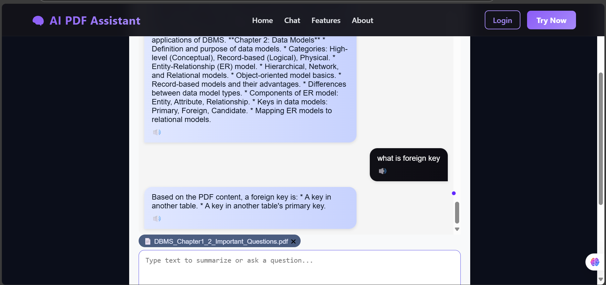

# 🧠 AI PDF Assistant

> Upload PDFs, get instant AI-powered summaries, ask questions, and listen to results with **Murf AI Voice**.



---

## 🌟 Overview

**AI PDF Assistant** is an intelligent full-stack web app that lets users:
- Upload and extract text from PDFs  
- Get real-time AI summaries (streamed word-by-word like ChatGPT)  
- Ask questions about the PDF content  
- Listen to summaries using **Murf AI's realistic voices**  

Built with **React + Node.js + WebSocket**, it provides a fast, interactive, and beautiful interface.

---

## ✨ Features

✅ Upload PDFs and extract readable text  
✅ Summarize content in real-time using **Google Gemini AI**  
✅ Ask contextual questions from the PDF  
✅ Listen to summaries with **Murf AI Text-to-Speech (TTS)**  
✅ ChatGPT-like live typing animation  
✅ Beautiful **dark glassy interface** built with React  
✅ Fast WebSocket-based streaming — no page reloads  

---

## 🧩 Tech Stack

| Layer | Technology | Purpose |
|--------|-------------|----------|
| **Frontend** | React (Vite) | Interactive UI with real-time chat |
| **Backend** | Node.js, Express | REST + WebSocket API |
| **AI** | Gemini API | Summarization & question answering |
| **TTS** | 🎙️ Murf AI API | Converts text summaries into human-like voice |
| **Database (optional)** | MongoDB | For storing chats or PDF history |

---

## ⚙️ Setup Instructions

### 1️⃣ Clone the repository
```bash
git clone https://github.com/YOUR_USERNAME/ai-pdf-assistant.git
cd ai-pdf-assistant
cd client
npm install


cd ../server
npm install
```
### Create .env file in server folder
- PORT=5000 
- GEMINI_API_KEY=your_gemini_api_key
- MURF_API_KEY=your_murf_api_key

### Start backend
- cd server
- run dev

### Start Client
- cd client
- npm run dev


## 💜 Built with Passion by Prachi Gupta
